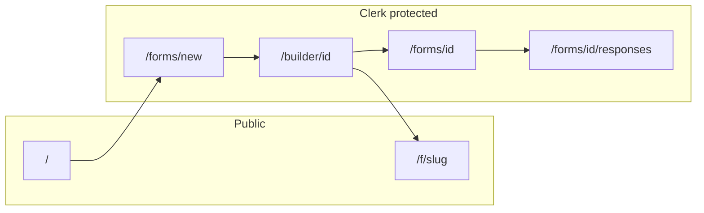

# Contractly — remaining work (backlog)

## What is already implemented

- **Stack:** Next.js 16 App Router, Prisma + PostgreSQL, Tailwind/shadcn-style UI, Zustand builder store.
- **Auth:** Clerk in [`proxy.ts`](proxy.ts); sign-in/up under `app/sign-in`, `app/sign-up`; [`Form.ownerId`](prisma/schema.prisma) with owner checks in [`lib/forms.ts`](lib/forms.ts) and [`app/actions/forms.ts`](app/actions/forms.ts).
- **User flow:** Landing → templates (`/forms/new`) → builder → publish → public fill (`/f/[slug]`) → manage + responses views.
- **i18n:** App locales en/es/hi for builder, fill, and templates.
- **Field types (only four):** `short_text`, `long_text`, `email`, `multiple_choice` in [`types/form.ts`](types/form.ts).
- **In-builder:** Duplicate/delete **fields** (not whole forms), reorder, localized labels.

No `TODO`/`FIXME` in TS. No `*.test.ts` / `*.spec.ts`. No `.github/workflows`. [`README.md`](README.md) is still default create-next-app text.

---

## What is still missing

### 1. Navigation and discovery

- **No “my forms” list:** No page that queries `Form` where `ownerId` matches the signed-in user. Add something like `app/dashboard/page.tsx` or `app/forms/page.tsx`, plus links from [`components/landing/home-page.tsx`](components/landing/home-page.tsx) / [`components/auth/auth-controls.tsx`](components/auth/auth-controls.tsx) when signed in.
- **`app/create/page.tsx`:** Only redirects to `/`. Either point it at the real “create form” flow (`createFormAndRedirect`) or remove the route.

### 2. Form lifecycle (whole form, not fields)

- **Published = frozen:** [`app/builder/[formId]/builder-client.tsx`](app/builder/[formId]/builder-client.tsx) disables editing when published; [`saveDraftForm`](lib/forms.ts) rejects non-drafts. There is no **unpublish**, **duplicate form**, or **delete form**.
- **Delete:** Add owner-checked delete (Prisma cascade already removes fields/submissions/answers).
- **Edit after publish — pick one:**
  - **Unpublish:** set `draft`, decide whether to keep or clear `slug`, then allow saves again; or
  - **Duplicate:** clone form + fields into a new draft for the same owner.

### 3. Richer questions

- New types need changes across [`types/form.ts`](types/form.ts), [`builder-client.tsx`](app/builder/[formId]/builder-client.tsx), [`fill-form.tsx`](app/f/[slug]/fill-form.tsx), [`submitResponse`](lib/forms.ts), [`responses-display.ts`](lib/responses-display.ts), [`lib/form-templates.ts`](lib/form-templates.ts), and locale JSON.
- **File uploads** imply object storage (S3/R2/Vercel Blob) — larger than a single type addition.

### 4. Responses

- **Export:** No CSV/JSON download in [`responses-view.tsx`](app/forms/[formId]/responses/responses-view.tsx). Implement via server action or `route.ts` using `listSubmissions` + field definitions.
- **Filtering/search:** Optional later (dates, text in answers).

### 5. Public submit hardening

- [`submitFormAction`](app/actions/forms.ts) / [`submitResponse`](lib/forms.ts) have no **rate limiting** or **CAPTCHA**. Add before exposing forms to untrusted traffic (e.g. Upstash rate limit, Cloudflare Turnstile).

### 6. Data hygiene

- **`ownerId` nullable:** Rows with `null` never pass [`getFormForBuilder`](lib/forms.ts). Document or script a backfill for legacy data.

### 7. Repo quality

- **README:** Replace boilerplate with pnpm, `DATABASE_URL`, migrations, Clerk env vars (see [`.env.example`](.env.example)).
- **CI:** Lint + `next build` on PRs.
- **Tests:** A few unit tests for `submitResponse` / owner guards; optional E2E with Clerk test mode.

### 8. Future proxy note

- If you add **webhook** `app/api/...` routes, add them to the **public** matcher in [`proxy.ts`](proxy.ts) so Clerk middleware does not require a user session on POST.

---

## Suggested order of implementation

1. **Dashboard (my forms)** — best UX return for effort.
2. **Delete form** — simple and expected.
3. **CSV export** — no schema change; high value for operators.
4. **Unpublish or duplicate** — product decision first, then backend + UI.
5. **One new field type** — establishes pattern for more.
6. **Rate limit / CAPTCHA** — before scaling public traffic.
7. **README + CI + tests** — onboarding and regression safety.

Adjust order if security or form depth is the immediate milestone.
